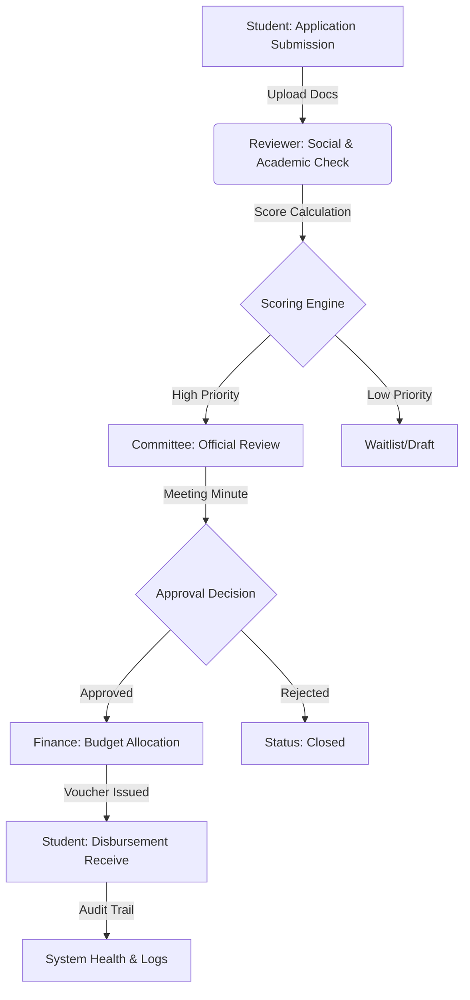

# Student Aid Management System (SAMS)
### Tanta University - Faculty of Science

A sophisticated, secure, and transparent web-based platform designed to manage student financial aid applications, scoring, approval workflows, and disbursement tracking with full auditing capabilities.

---

## 🔄 Application Lifecycle Workflow




---

## 🌟 Key Features

### 1. Advanced RBAC (Role-Based Access Control)
Comprehensive multi-user system with distinct interfaces and permissions:
- **Students**: Apply for aid, upload documents, and track application status.
- **Reviewers**: Evaluate applications based on academic and social criteria.
- **Committee Heads**: Manage programs, oversee reviews, and issue final approvals.
- **Auditors**: Monitor all system actions, budget changes, and access logs for transparency.
- **Administrators**: Full system configuration, user management, and financial oversight.

### 2. Intelligent Scoring Engine
The system employs a dynamic scoring algorithm that evaluates students based on configurable rules:
- **Rule Composition**: Rules consist of a `criteria_type` (e.g., GPA, Income Tier) and a `condition` (JSON-based range, e.g., `{"min": 0, "max": 2000}`).
- **Weighted Scoring**: Each rule has a `weight` and `points`. The final score is a weighted sum, allowing administrators to prioritize certain criteria over others without changing the code.
- **Priority Ranking**: Applications are automatically sorted by their calculated score, ensuring that the most needy students are reviewed first.

### 3. Financial Integrity & Academic Linkage
Unlike simple forms, SAMS links academic data with financial reality:
- **Budget Reservation**: When an application is approved, the system automatically moves funds from `Total Budget` to `Reserved Budget`.
- **Atomic Transactions**: All financial updates are wrapped in database transactions to prevent race conditions or data corruption.
- **Double-Entry Logic**: Any change in a student's allocation is mirrored by an update in the Support Cycle's global budget metrics.

### 4. Governance & The Audit Engine
Transparency is at the heart of SAMS. The `Audit` module acts as a "Black Box" for the system:
- **Field-Level Auditing**: Every change to an application's status or financial data records the `old_value` and `new_value` in JSON format.
- **Non-Repudiation**: Decisions are linked to specific `CommitteeMeetingMinute` records, ensuring every approved penny has an official paper trail.
- **Access Monitoring**: Every administrative login and sensitive data access is logged with IP and User-Agent strings.

---

## 🏛 Modular Architecture & App Breakdown

The system is built with a decoupled, modular architecture to ensure scalability and maintainability.

### 👥 1. Accounts App (`accounts/`)
**Responsibility**: Identity Management & Role-Based Access Control (RBAC).
- **Custom User Model**: Extends Django's user to support roles (Student, Reviewer, Auditor, etc.) and National ID tracking.
- **Dynamic Profiles**: Separate profile models for each role to store specific metadata (e.g., GPA for students, Academic Rank for reviewers).
- **Permission Mixins**: A centralized library of security mixins that enforce "Program-Level" isolation, ensuring users only see data belonging to their assigned academic department.

### 💰 2. Aid Management App (`aid_management/`)
**Responsibility**: Core Business Logic & Financial Orchestration.
- **Support Cycles**: Manages the timeframe and global budget for specific aid rounds.
- **Scoring Engine**: Implements the logic for `ScoringRule` evaluation.
- **Application Lifecycle**: Handles the transition states of student applications (Draft -> Submitted -> Under Review -> Approved/Rejected).
- **Budget Tracking**: Real-time management of `BudgetAllocation` and atomic updates to the cycle's reserved/disbursed funds.

### 📄 3. Assets & Reporting App (`assets_reporting/`)
**Responsibility**: Artifact Management & Governance.
- **Document Management**: Handles secure uploads of sensitive student documents (Social Research, Identity docs) with automated file path isolation.
- **Governance Tools**: Manages `CommitteeMeetingMinute` to link financial decisions to official administrative meetings.
- **Output Generation**: Handles the creation of `OfficialReport` and `DisbursementVoucher` with QR code integration for physical verification.

### 🔍 4. Audit App (`audit/`)
**Responsibility**: Monitoring, Transparency & Forensic Logging.
- **Data Audit**: A high-granularity logger that captures every change in the system, including "Before" and "After" snapshots of database rows.
- **Process Logging**: Records structural changes like opening/closing cycles or overriding scores.
- **Access Logs**: Monitors IP-based login history and failed access attempts.
- **Financial Integrity**: A logic layer that runs cross-checks between applications and global budget state to detect any discrepancies.

---

## 🗄️ Database Architecture & Data Integrity

The system utilizes a relational database structure designed for high integrity and forensic traceability.

### 🧬 Key Relational Schema
- **UUID Primary Keys**: Most core entities (Applications, Documents, Logs) use `UUID` instead of auto-incrementing integers to prevent ID enumeration attacks and ensure global uniqueness.
- **Profile Pattern**: A 1-to-1 relationship between `User` and role-specific profiles (`StudentProfile`, `ReviewerProfile`) keeps the user table lean and extensible.
- **Many-to-Many Mappings**: Programs are linked to Reviewers and Auditors via M2M tables, allowing a single staff member to oversee multiple academic departments.

### 📊 Specialized Data Handling
- **JSON Snapshots**: The `Audit` module uses `JSONField` to store full object states before and after changes, allowing for point-in-time recovery and detailed change tracking.
- **Dynamic Scoring Rules**: Rules are stored as JSON-serialized conditions, enabling complex logical checks (e.g., `range`, `membership`) without complex schema migrations.
- **Atomic Budgets**: Financial values are stored using `DecimalField` to prevent floating-point errors, ensuring 100% accuracy in currency calculations.

### 🛡️ Data Security & Privacy
- **Media Isolation**: Student documents are stored in directories partitioned by their unique Student ID, preventing cross-access.
- **Soft Deletion**: Sensitive records (like Applications) implement soft-delete patterns to maintain audit trails even after removal from the primary interface.
- **IP & User-Agent Tracking**: Every critical mutation is tagged with the actor's networking metadata.

---

## 🛠 Technology Stack

- **Backend**: Django 6.0.2 (Python 3.13+)
- **Frontend**: Tailwind CSS (via django-tailwind), Alpine.js for interactivity.
- **Database**: PostgreSQL (Production ready), SQLite (Development/Testing).
- **UI/UX**: Custom RTL (Arabic) support with a premium, responsive dashboard design.

---

## 🚀 Getting Started

### Prerequisites
- Python 3.10+
- Node.js (for Tailwind CSS)
- Git

### Installation

1. **Clone the repository**:
   ```bash
   git clone https://github.com/Abdelrahman74S/Student-Aid-Management-System.git
   cd Student-Aid-Management-System
   ```

2. **Setup Virtual Environment**:
   ```bash
   python -m venv .venv
   .venv\Scripts\activate  # Windows
   source .venv/bin/activate  # Linux/Mac
   ```

3. **Install Dependencies**:
   ```bash
   pip install -r requirements.txt
   ```

4. **Database Initialization**:
   ```bash
   python manage.py migrate
   python manage.py createsuperuser
   ```

5. **Tailwind CSS Setup**:
   ```bash
   python manage.py tailwind install
   ```

### Running the Project

You need two terminals running simultaneously:

- **Terminal 1 (Django Server)**:
  ```bash
  python manage.py runserver
  ```

- **Terminal 2 (Tailwind Builder)**:
  ```bash
  python manage.py tailwind start
  ```

---

## 🛡 System Maintenance

### Health Diagnostics
The system includes a custom management command to verify database integrity and financial consistency:
```bash
python manage.py system_health
```

---

## ⚖️ License
This project is developed as part of the Graduation Project for Tanta University. All rights reserved.